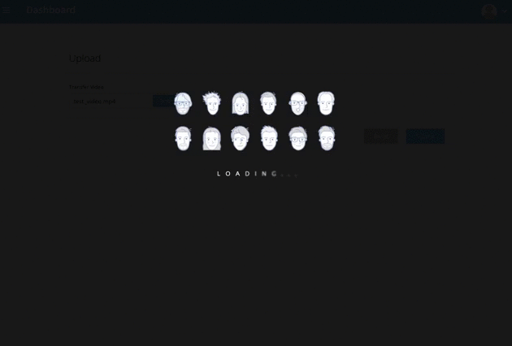

## Computer Vision project

### Face Swap
#### 1. image2image face swap

#### 2. image2video face swap

### Face Alignment 
#### 1. Image landmark

#### 2. Video landmark

## Reference
[videowriter](https://stackoverflow.com/questions/10605163/opencv-videowriter-under-osx-producing-no-output)

## Flask
[flask中使用藍圖](https://www.itread01.com/article/1516325036.html)
[BluePrint_藍圖](https://hackmd.io/@shaoeChen/H1HIg0kqW?type=view)
[REST APIs with Flask 系列教學文](https://medium.com/@twilightlau94/rest-apis-with-flask-%E7%B3%BB%E5%88%97%E6%95%99%E5%AD%B8%E6%96%87-1-5405216d3166)

## FaceSwap
[FaceSwap Fix](https://blog.csdn.net/FJY_sunshine/article/details/82354197)
[Plt fix](https://www.pydoc.io/pypi/imgui-datascience-0.2.9/autoapi/imgui_fig/index.html)