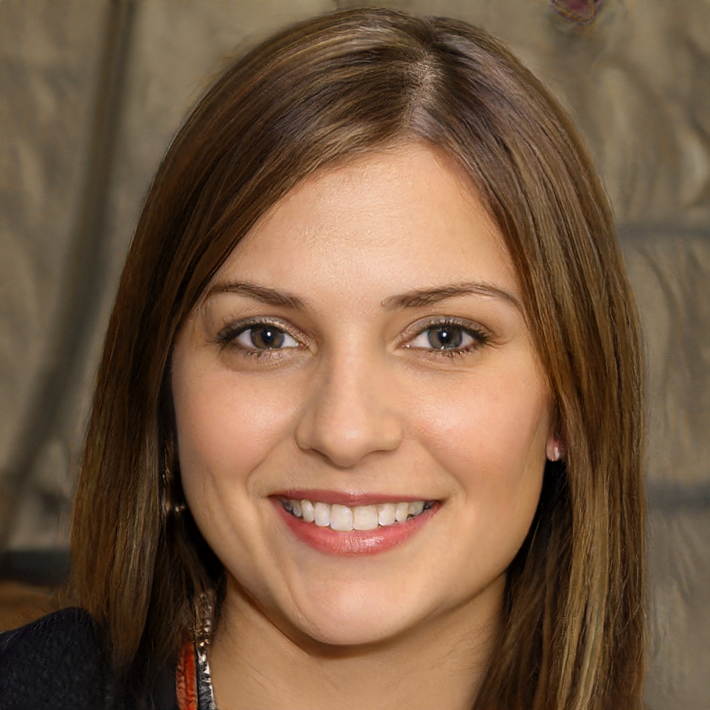
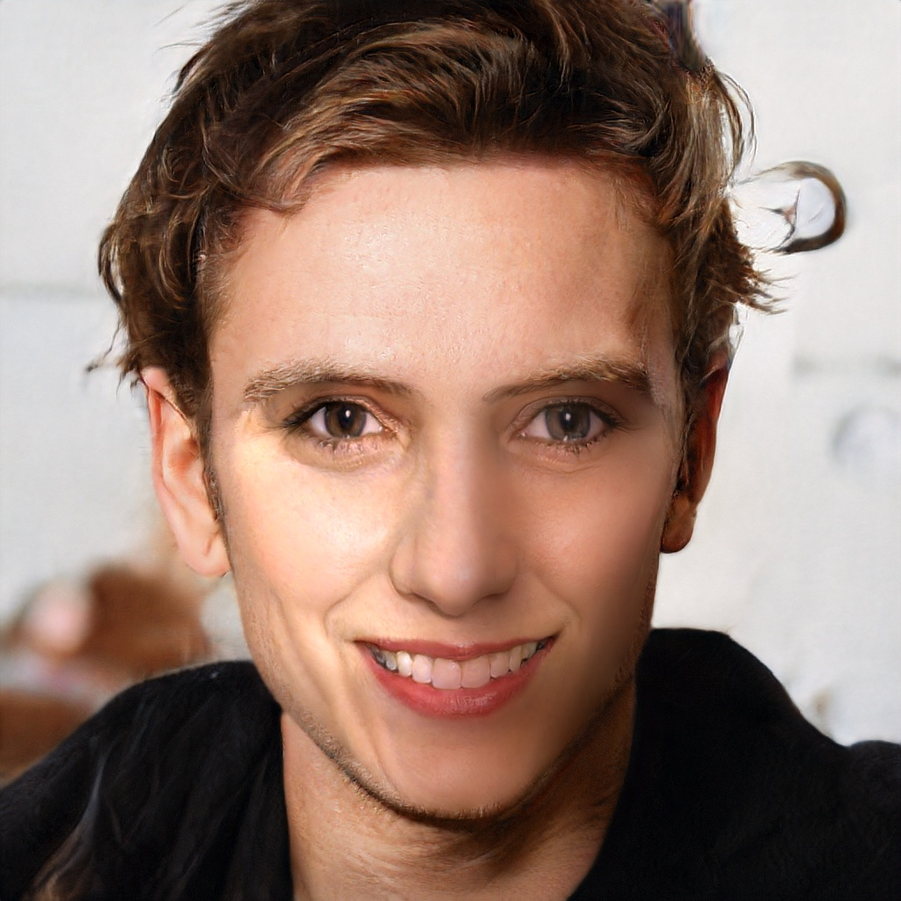
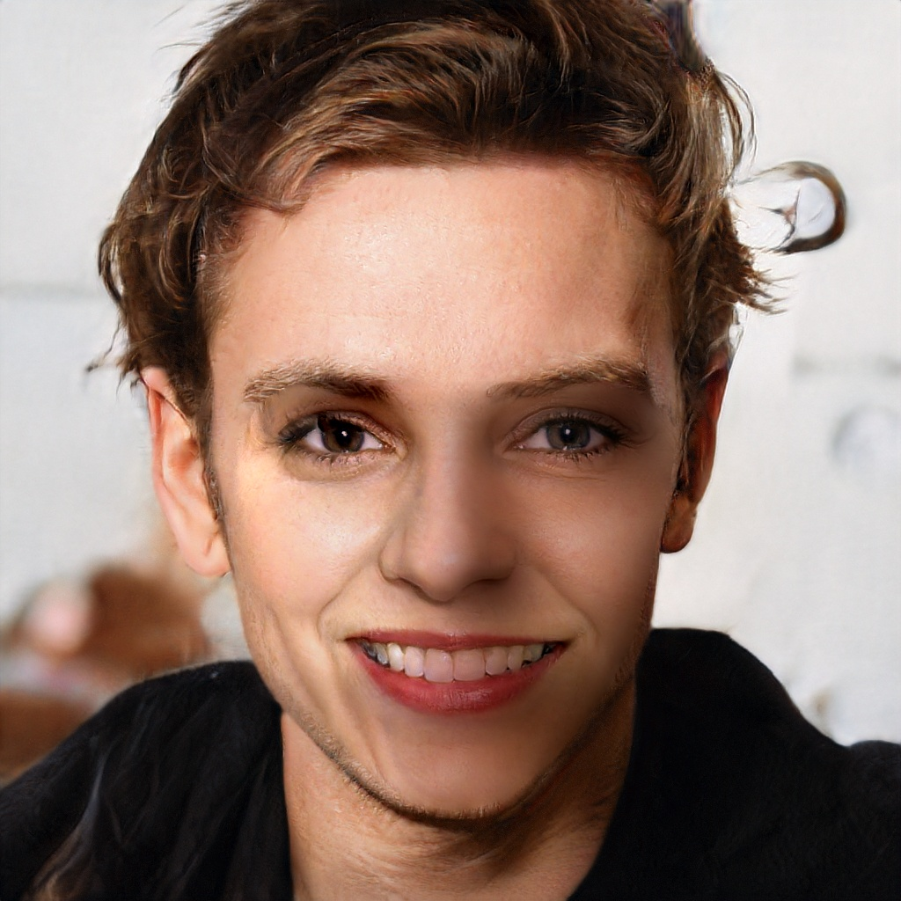

# FaceSwap
Swap face between two photos for Python 3 with OpenCV and dlib.

## Get Started
```sh
python main.py --src static/test1.jpg --dst static/test2.jpg --out output/test.jpg --correct_color
```

| Source | Destination | Result |
| --- | --- | --- |
| |  |  |

```sh
python main.py --src static/test1.jpg --dst static/test2.jpg --out output/test.jpg --correct_color --warp_2d
```

| Source | Destination | Result |
| --- | --- | --- |
| |  |  |


## Install
### Requirements
* `pip install -r requirements.txt`
* OpenCV 3: `conda install opencv` (If you have conda/anaconda)

Note: See [requirements.txt](requirements.txt) for more details.
```
### Swap Your Face
```sh
python main.py ...
```
Note: Run **python main.py -h** for more details.


### Real-time camera
```sh
python video_handler.py --src_img static/test1.jpg
```
### Video
```sh
python video_handler.py --src_img static/test1.jpg --video_path static/test_video.mp4
```
Make sure the landmarks actually locate in the face. Then drag the left mouse to make a rectangle, it should surround the face. Finally, we handle our video. Note that the demo works best with good, even lighting. The demo also needs support for opencv TRACKER(see config).


